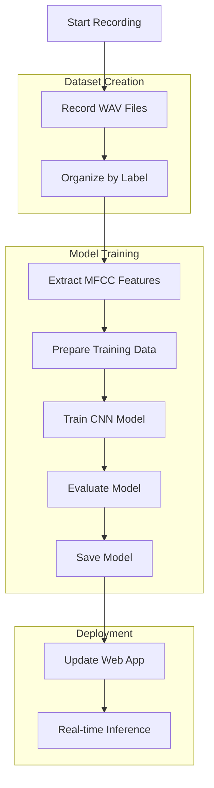

# TensorFlow.js Vowel Recognition Training System

## Overview
Replace the current ml5.js/Teachable Machine implementation with a local TensorFlow.js training pipeline for vowel recognition (A, E, I, O, U, Noise).

## Current Architecture
```
Current: Browser → ml5.js → Teachable Machine Model (techeable/model.json)
New: Browser → @tensorflow/tfjs → Custom Trained Model (trained/model.json)
```

## Technical Approach
1. **Recording Phase**: Node.js script to record WAV files (0.6 seconds each)
2. **Feature Extraction**: MFCC (Mel-frequency cepstral coefficients) extraction from WAV files
3. **Training**: CNN model training using TensorFlow.js Node
4. **Export**: Save model in TensorFlow.js format
5. **Integration**: Update web app to load and use the new model

## Project Structure
```
d:/Simple_Vtuber/
├── dataset/              # WAV files organized by label
│   ├── A/
│   ├── E/
│   ├── I/
│   ├── O/
│   ├── U/
│   └── noise/
├── trained/              # Trained models
│   ├── model.json
│   └── weights.bin
├── scripts/              # Training scripts
│   ├── record.js
│   ├── extract_features.js
│   ├── train_model.js
│   ├── test_model.js
│   └── utils.js
├── package.json          # Updated with TensorFlow.js dependencies
├── index.html            # Updated to use @tensorflow/tfjs
└── app.js               # Updated for TensorFlow.js inference
```

## Dependencies Required
```json
{
  "@tensorflow/tfjs": "^4.0.0",
  "@tensorflow/tfjs-node": "^4.0.0",
  "node-record-lpcm16": "^0.3.1",
  "wav-decoder": "^1.3.0",
  "wav-encoder": "^1.3.0",
  "meyda": "^5.2.0",
  "fs-extra": "^11.0.0"
}
```

## Todo List

### Phase 1: Project Setup & Dependencies
- [ ] Create/update `package.json` with TensorFlow.js dependencies
- [ ] Install required npm packages
- [ ] Create directory structure (dataset/, trained/, scripts/)
- [ ] Create basic configuration file

### Phase 2: Audio Recording System
- [ ] Create `scripts/record.js` for recording WAV files
- [ ] Implement command-line interface for recording by label
- [ ] Add validation for audio device availability
- [ ] Create helper script for batch recording

### Phase 3: Feature Extraction
- [ ] Create `scripts/extract_features.js` for MFCC extraction
- [ ] Implement WAV file reading and decoding
- [ ] Extract MFCC features using Meyda library
- [ ] Normalize and prepare features for training
- [ ] Save features to JSON file for training

### Phase 4: Model Training
- [ ] Create `scripts/train_model.js` for CNN model training
- [ ] Design CNN architecture for MFCC features (43x232x1 input)
- [ ] Implement data loading and batching
- [ ] Configure training parameters (epochs, batch size, learning rate)
- [ ] Add validation split and early stopping
- [ ] Implement model saving in TensorFlow.js format

### Phase 5: Model Testing & Evaluation
- [ ] Create `scripts/test_model.js` for accuracy testing
- [ ] Load trained model and test on validation set
- [ ] Generate confusion matrix
- [ ] Calculate precision, recall, F1-score
- [ ] Export performance metrics

### Phase 6: Web App Integration
- [ ] Update `index.html` to load @tensorflow/tfjs instead of ml5.js
- [ ] Modify `app.js` to use TensorFlow.js for inference
- [ ] Implement real-time audio processing for prediction
- [ ] Update UI to show TensorFlow.js predictions
- [ ] Add model loading status and error handling

### Phase 7: Documentation & Usage
- [ ] Create `README_TRAINING.md` with usage instructions
- [ ] Add example commands for recording and training
- [ ] Document model architecture and parameters
- [ ] Create troubleshooting guide

## Detailed Script Specifications

### 1. `scripts/record.js`
```javascript
// Usage: node scripts/record.js <label> <index>
// Example: node scripts/record.js A 1
// Records 0.6 seconds of audio and saves to dataset/A/A_1.wav
```

### 2. `scripts/extract_features.js`
```javascript
// Extracts MFCC features from all WAV files in dataset/
// Creates features.json with:
// {
//   "features": [array of MFCC vectors],
//   "labels": [array of label indices],
//   "labelNames": ["A", "E", "I", "O", "U", "noise"]
// }
```

### 3. `scripts/train_model.js`
```javascript
// Loads features.json
// Creates CNN model:
// Input: (43, 232, 1)  # MFCC features
// Layers: Conv2D → MaxPooling → Conv2D → MaxPooling → Flatten → Dense → Output
// Output: 6 classes (A, E, I, O, U, noise)
// Saves model to trained/model.json and trained/weights.bin
```

### 4. `scripts/test_model.js`
```javascript
// Loads trained model and test data
// Runs predictions and calculates accuracy
// Outputs confusion matrix and metrics
```

## Model Architecture
```
Input: (43, 232, 1)  # MFCC features (43 coefficients × 232 time frames)
Conv2D: 8 filters, (2, 8) kernel, ReLU activation
MaxPooling2D: (2, 2) pool size
Conv2D: 32 filters, (2, 4) kernel, ReLU activation
MaxPooling2D: (2, 2) pool size
Flatten
Dense: 64 units, ReLU activation
Dropout: 0.5
Dense: 6 units, Softmax activation (output)
```

## Training Parameters
- Epochs: 40
- Batch size: 32
- Learning rate: 0.001
- Validation split: 0.2
- Early stopping patience: 10 epochs

## Integration Changes to Web App

### Current `app.js` (ml5.js approach):
```javascript
// ml5.js approach
soundClassifier = await ml5.soundClassifier('./techeable/model.json', options);
soundClassifier.classify(gotResult);
```

### New `app.js` (TensorFlow.js approach):
```javascript
// TensorFlow.js approach
const model = await tf.loadLayersModel('./trained/model.json');
const prediction = model.predict(audioFeatures);
```

## Mermaid Diagram: Training Pipeline


## Success Criteria
1. Training scripts successfully record and process audio
2. Model achieves >85% accuracy on validation set
3. Web app loads TensorFlow.js model without errors
4. Real-time vowel detection works with similar performance to current system
5. All scripts are documented and easy to use

## Risks & Mitigations
1. **Audio recording issues**: Test with different microphones, add device selection
2. **MFCC extraction problems**: Validate with sample audio, adjust parameters
3. **Training convergence issues**: Adjust architecture, learning rate, data augmentation
4. **Browser compatibility**: Test in multiple browsers, provide fallback
5. **Performance issues**: Optimize model size, use WebGL backend

## Next Steps
1. Review and approve this plan
2. Switch to Code mode for implementation
3. Implement Phase 1 (Project Setup)
4. Progress through remaining phases
5. Test complete pipeline
6. Deploy updated web app